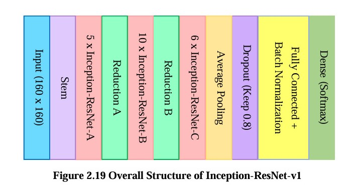
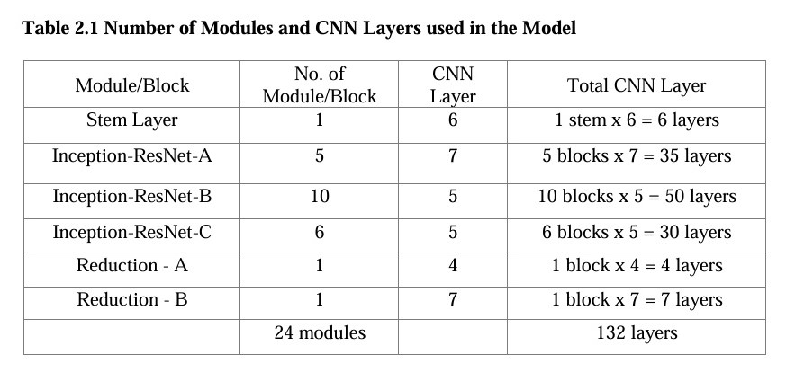
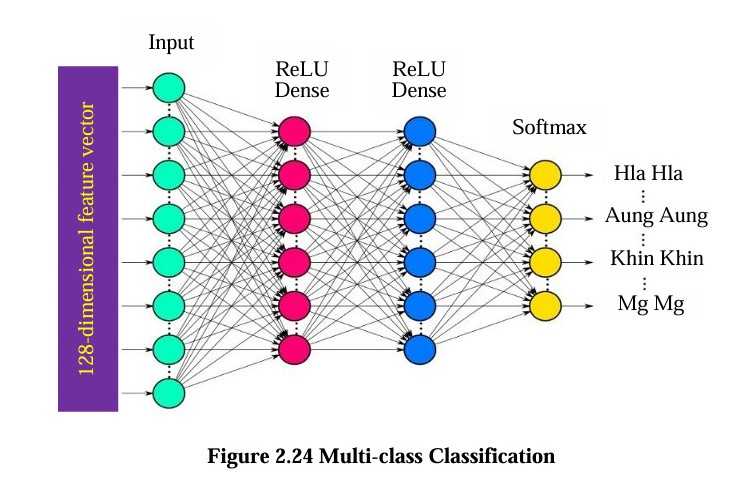
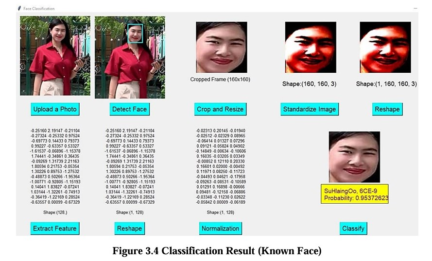
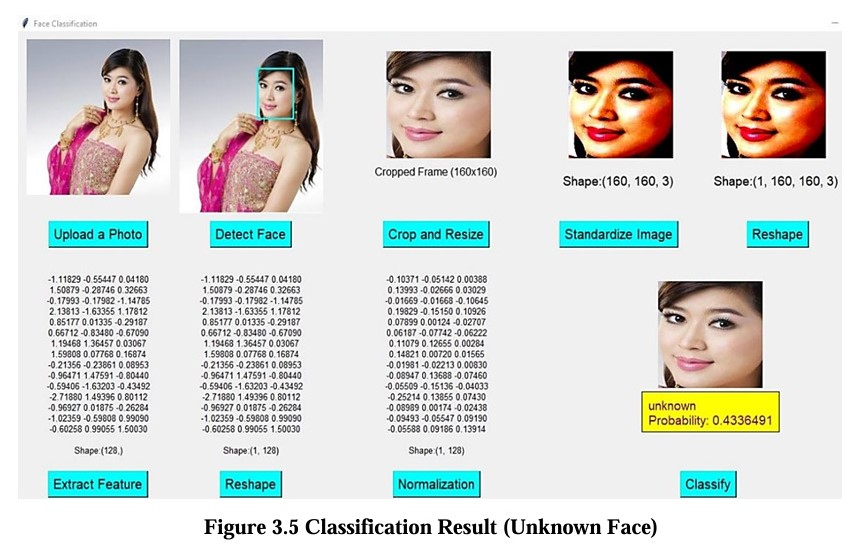
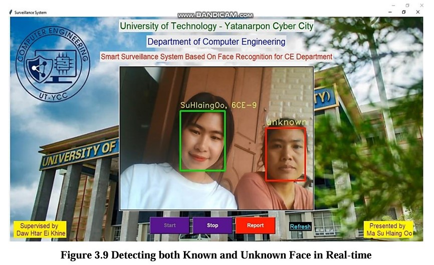

# 🎯 Face Recognition Surveillance System

A **real-time face recognition surveillance system** using **InceptionResNetV1** and a custom classifier.  
Recognizes a predefined set of individuals from live video or single images.

---

## 📋 Table of Contents
- [Python Version](#-python-version)
- [Project Overview](#-project-overview)
- [Project Structure](#-project-structure)
- [Usage](#-usage)
- [Notes](#-notes)
- [Dataset](#-dataset)
- [Face Detection](#-face-detection)
- [Feature Extraction](#-feature-extraction)
- [Classificaton](#-classification)
- [System Implementation Result](#-system-implementation-result)
- [References](#-references)

---

## 🐍 Python Version
- Tested with **Python 3.6.8**

---
## 🎯 Project Overview  

This surveillance system is built on a face recognition framework that integrates multiple components: **MTCNN** for face detection, **InceptionResNetV1** for feature extraction, and a neural network for classification.  

The system achieves an accuracy of **87.62%** in distinguishing between *known* and *unknown* individuals. It can reliably detect human faces except in cases where the face is covered (e.g., masks, obstructions) or under poor lighting conditions.  

To enhance safety and security, the system raises an alarm whenever an *unknown* face is detected. Additionally, a report is generated and sent to the administrator via email, containing a CSV file of all *known* faces and a table of *unknown* faces identified by the system.  

---

## 📂 Project Structure

| File | Description |
|------|-------------|
| `InceptionResNetV1.py` | Defines the **InceptionResNetV1** architecture. Supports **transfer learning** using `weights/MS_Celeb_weight.h5`. |
| `Model_Notebook.ipynb` | Trains a **feature extraction model** on **20 individuals** and saves it to `file/My_Model.h5`. |
| `extractFeature.py` | Extracts features from images and saves them in `file/ce_embedding.npz`. |
| `classifier.py` | Trains a **classifier** on the extracted features and saves it to `file/classifier.h5`. |
| `app.py` | Runs the **real-time face recognition surveillance system**. Detects and classifies faces from live camera feed. |
| `single_test.py` | Step-by-step visualization for face recognition on a **single image**; useful for testing and debugging. |

---

## ⚙️ Usage

1. Train the feature extraction model:  
   `Model_Notebook.ipynb`
2. Extract features:  
   `python extractFeature.py`
3. Train the classifier:  
   `python classifier.py`
4. Run real-time surveillance:  
   `python app.py`
5. Test individual images:  
   `python single_test.py`

---

## 📝 Notes
- Ensure the **pre-trained weights** file is available: `weights/MS_Celeb_weight.h5`.
- All models and extracted features are saved under the `file/` directory.
- Compatible with **Python 3.6.8**; minor adjustments may be required for newer Python versions.

---
## 📂 Dataset  

The dataset is stored in the **'CE'** directory, which contains two subfolders: **'train'** and **'test'**.  
- Images in the *train* folder are used for model training.  
- Images in the *test* folder serve as unseen data to evaluate the model’s accuracy.  

---
## 👤 Face Detection

Multi-task Cascaded Convolutional Neural Network (MTCNN) is a deep learning–based face detection algorithm built on cascaded convolutional neural networks. In this project, we use its Python implementation as the face detection library.

---
## 🔍 Feature Extraction

InceptionResNetV1 is used for feature extraction. The structure & layers of InceptionResNetV1 used in this project are as follows:

---
## Classification
In the classification layer of this system, the model consists of the following components: This input layer takes the 128 vector embedding generated from the Inception-ResNet-V1 model which serves as the entry point for the data into the neural 
network and 2 hidden layers each followed by a dropout layer. The output layer includes neurons corresponding to the number of target classes. It uses the Softmax activation function to convert the output into a probability distribution over the classes, making it suitable for multi-class classification. 

---
## 🖼️ System Implementation Result  

   The following screenshots illustrate the step-by-step process of how the face recognition system analyzes a human face image, identifies it, and classifies it with a label (known or unknown) along with the corresponding probability.

  The screenshot below shows the system successfully identifying multiple faces appearing in the monitoring area at the same time.  

---

## 📌 References
- [InceptionResNetV1 Paper](https://arxiv.org/abs/1602.07261)
- [Keras Face Recognition Example](https://keras.io/examples/vision/face_recognition/)

---

